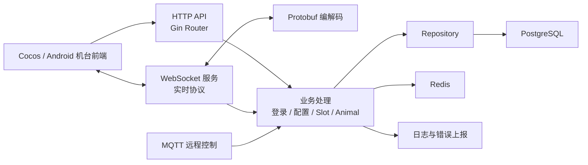
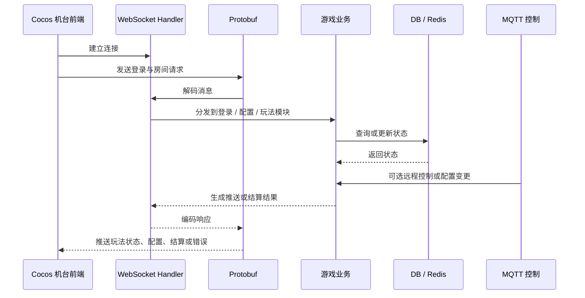

# slotgame-go Showcase

> Go 游戏后端展示仓库。原项目为私有商业项目，本仓库只公开脱敏后的项目说明、服务分层、协议协作流程和职责说明，不公开源码、真实配置、数据库信息、密钥或运营数据。

## 项目简介

`slotgame-go` 是一个服务于实体拉霸机 / 游戏机台的 Go 后端项目，用于支撑 HTTP API、WebSocket 实时协议、Protobuf 消息、MQTT 远程控制、数据库持久化、缓存和机台运维能力。项目与 Cocos / Android 机台前端协作，处理登录、房间、玩法状态推送、结算、配置、异常日志和远程控制等能力。

本公开仓库用于展示我对游戏后端、实时协议和前后端联调链路的理解，不包含任何后端源码或生产配置。

## 技术栈

- Go 1.x
- Gin
- GORM
- PostgreSQL
- Redis
- WebSocket
- Protobuf
- MQTT
- zap
- Docker / Makefile

## 我关联和理解的内容

- 理解 Cocos 前端与 Go 后端之间的 WebSocket + Protobuf 协作方式。
- 基于后端目录结构梳理登录、配置、Slot、Animal、MQTT 等模块职责。
- 理解 HTTP 路由、Repository、Model、WebSocket Handler、MQTT Handler 的分层关系。
- 使用 Codex 辅助阅读 Go 服务端项目，整理协议处理链路、接口联调说明和排查清单。
- 从前端视角理解后端推送数据、房间状态、结算状态和异常上报的影响。

## 脱敏目录职责

```text
routes/        # HTTP API 路由
websocket/     # 实时连接、登录、配置、Slot 玩法协议处理
mqtt/          # MQTT 客户端、路由、远程控制和重连
repository/    # 数据访问层
models/        # 数据模型
sgdb/          # 数据库与缓存连接
proto/         # Protobuf 协议定义
internal/pb/   # Protobuf 生成产物
logger/        # 日志封装
conf/          # 本地配置，公开仓库不包含真实值
```

## 后端架构关系



## 协议流转



## AI / Codex 使用方式

- 辅助梳理 Go 项目目录、服务分层和协议处理链路。
- 辅助从前端联调角度理解后端消息流、状态变更和错误处理。
- 生成模块说明、接口说明、联调文档和问题排查清单。
- 将私有项目结构整理为适合公开展示的脱敏 README。

## 为什么不公开源码也能展示工程能力

- 后端项目包含实时连接、协议编解码、数据库、缓存、MQTT 和日志等多个工程面。
- README 展示了我对服务分层、协议流转、前后端联调和机台运行场景的理解。
- 商业后端项目必须保护源码、真实配置、生产部署脚本、运营数据和协议细节。

## 公开边界

本仓库可以公开：

- 脱敏 README
- 服务分层说明
- 协议协作流程图
- 目录职责说明
- AI / Codex 使用方式

本仓库不会公开：

- Go 源码
- 真实数据库配置、MQTT 凭证、服务器地址、Token、密钥
- 生产部署脚本、内部协议细节
- 真实运营数据、流水、账号、日志
