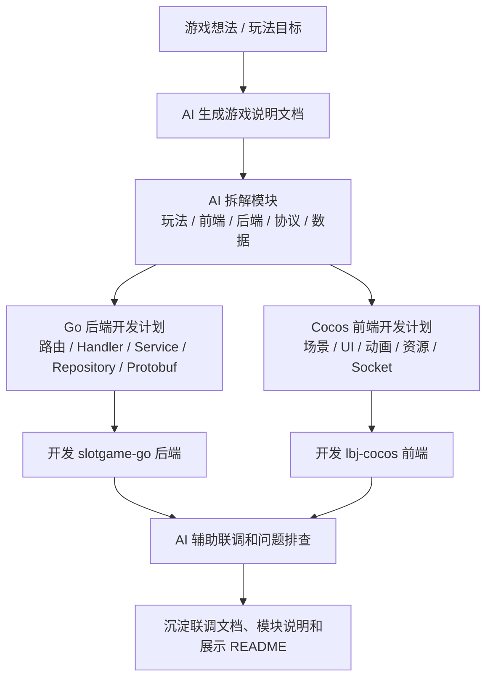
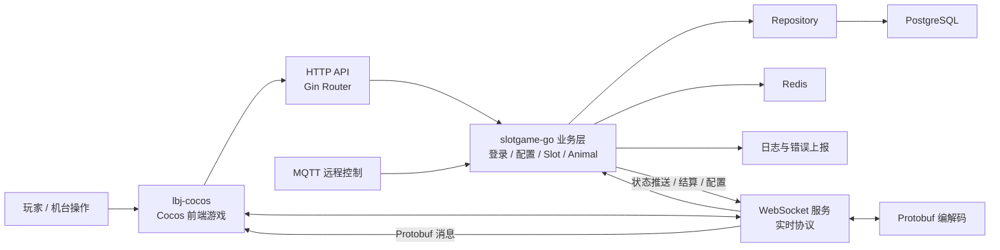
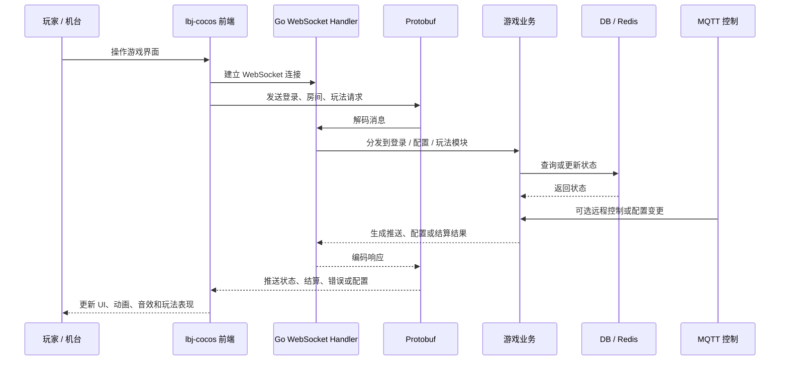

# slotgame-fullstack Showcase

> AI 驱动的游戏全栈开发展示仓库。项目由 Go 后端 `slotgame-go` 和 Cocos 前端游戏 `lbj-cocos` 组成，核心特点是使用 AI / Codex 逐步生成游戏说明文档、模块拆解、协议联调说明和开发计划，再推进后端与前端开发。本仓库只公开脱敏后的项目说明，不公开源码、真实配置、数据库信息、密钥、服务器地址或运营数据。

## 项目简介

`slotgame-go` 不是单独存在的拉霸机后端，而是与 Cocos 前端游戏项目 `lbj-cocos` 配套的全栈游戏系统。前端负责游戏界面、资源、动画、玩法表现、用户操作和实时状态展示；后端负责 HTTP API、WebSocket 实时协议、Protobuf 消息、MQTT 远程控制、数据库持久化、缓存、配置和机台运维能力。

该项目的重点不是单纯展示某个技术栈，而是展示“AI 辅助全栈开发”的工作方式：先让 AI 帮助把游戏玩法、模块边界、协议流转、前后端职责和联调步骤整理成说明文档，再基于文档逐步开发 Go 后端和 Cocos 前端。

## 项目组成

```text
slotgame-go   # Go 游戏后端：接口、协议、房间、结算、配置、MQTT、数据库和缓存
lbj-cocos     # Cocos 前端游戏：UI、动画、资源、玩法表现、Socket 协议和构建配置
```

## 技术栈

### 后端

- Go 1.x
- Gin
- GORM
- PostgreSQL
- Redis
- WebSocket
- Protobuf
- MQTT
- zap
- Docker / Makefile

### 前端

- Cocos Creator 2.4.x
- TypeScript
- Cocos Bundle / Prefab / Scene / Animation / Audio
- WebSocket
- Protobuf
- Cocos 构建配置与资源管理

## 全栈开发重点

- 使用 AI / Codex 把游戏需求逐步整理成可执行的说明文档。
- 基于 AI 生成的模块拆解，规划 Go 后端的路由、协议、模型、数据层和实时推送。
- 基于 AI 生成的玩法说明，规划 Cocos 前端的界面、资源、动画、状态展示和协议接入。
- 通过 WebSocket + Protobuf 完成前后端实时联调。
- 用 AI 辅助生成联调清单、排查步骤、模块说明和公开展示 README。
- 在不公开源码的前提下，展示完整的游戏全栈开发过程和工程理解。

## AI 驱动开发流程



详细流程见：[docs/ai-workflow.md](docs/ai-workflow.md)

## 脱敏目录职责

### Go 后端

```text
routes/        # HTTP API 路由
websocket/     # 实时连接、登录、配置、Slot 玩法协议处理
mqtt/          # MQTT 客户端、路由、远程控制和重连
repository/    # 数据访问层
models/        # 数据模型
sgdb/          # 数据库与缓存连接
proto/         # Protobuf 协议定义
internal/pb/   # Protobuf 生成产物
logger/        # 日志封装
conf/          # 本地配置，公开仓库不包含真实值
```

### Cocos 前端

```text
assets/
  scene/        # 启动场景
  script/       # 启动脚本与基础插件
  resources/    # 动态加载资源
  res/          # 图片、图集、字体、动画等资源
settings/       # Cocos Creator 项目与构建配置
packages/       # Creator 编辑器扩展工具
build/          # 构建产物，公开仓库不上传
```

## 前后端架构关系



## 联调与协议流转



## AI / Codex 使用方式

- 先用 AI 生成游戏说明文档，明确玩法目标、前端表现、后端能力和联调边界。
- 再用 AI 拆解模块，形成前端页面、资源、动画、Socket 协议、后端路由、数据层和推送逻辑的开发清单。
- 开发过程中持续让 Codex 辅助阅读代码结构、定位问题、补充接口说明和联调步骤。
- 后端侧用 AI 辅助整理 Go 服务分层、WebSocket Handler、Protobuf 消息、MQTT 控制和数据库访问关系。
- 前端侧用 AI 辅助整理 Cocos 启动场景、资源结构、UI 状态、动画表现和协议接入方式。
- 最后用 AI 将开发过程沉淀为模块说明、接口说明、排查清单和脱敏公开 README。

## 为什么不公开源码也能展示工程能力

- 该项目覆盖 Cocos 前端表现、Go 后端协议、数据库、缓存、MQTT、日志和机台运行场景，是一个完整的游戏全栈案例。
- README 展示了我如何使用 AI 从游戏说明文档开始，逐步拆解模块、推进前后端开发、完成联调并沉淀文档。
- README 也展示了我对前端游戏表现、服务分层、协议流转、前后端联调和运行维护的理解。
- 商业项目必须保护源码、真实配置、生产部署脚本、运营数据、协议细节和商业素材。
