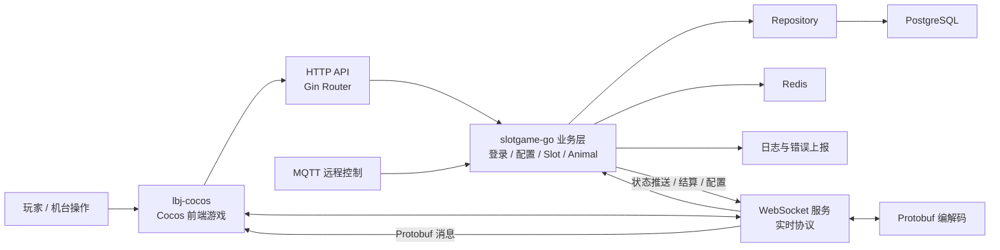
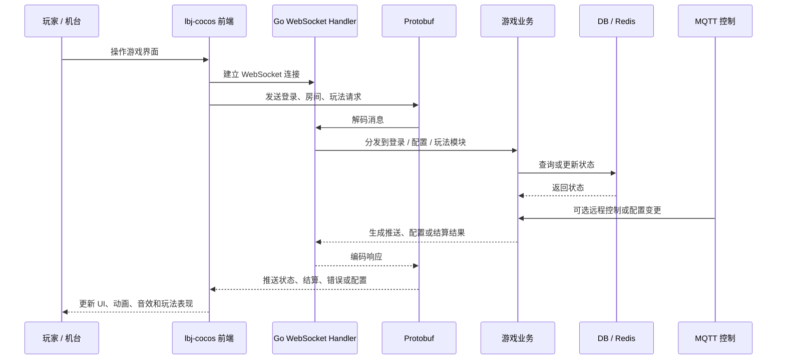

# slotgame-go Showcase

> 游戏前后端配套展示仓库。原项目由 Go 后端 `slotgame-go` 和 Cocos 前端游戏 `lbj-cocos` 组成，均为私有商业项目。本仓库只公开脱敏后的项目说明、前后端协作链路、服务分层和职责说明，不公开源码、真实配置、数据库信息、密钥、服务器地址或运营数据。

## 项目简介

`slotgame-go` 不是单独存在的拉霸机后端，而是与 Cocos 前端游戏项目 `lbj-cocos` 配套的游戏系统。前端负责游戏界面、资源、动画、玩法表现、用户操作和实时状态展示；后端负责 HTTP API、WebSocket 实时协议、Protobuf 消息、MQTT 远程控制、数据库持久化、缓存、配置和机台运维能力。

本公开仓库用于展示我对游戏前端、Go 后端、实时协议和前后端联调链路的整体理解，不包含任何私有源码或生产配置。

## 项目组成

```text
slotgame-go   # Go 游戏后端：接口、协议、房间、结算、配置、MQTT、数据库和缓存
lbj-cocos     # Cocos 前端游戏：UI、动画、资源、玩法表现、Socket 协议和构建配置
```

## 技术栈

### 后端

- Go 1.x
- Gin
- GORM
- PostgreSQL
- Redis
- WebSocket
- Protobuf
- MQTT
- zap
- Docker / Makefile

### 前端

- Cocos Creator 2.4.x
- TypeScript
- Cocos Bundle / Prefab / Scene / Animation / Audio
- WebSocket
- Protobuf
- Cocos 构建配置与资源管理

## 我关联和理解的内容

- 理解 Cocos 前端与 Go 后端之间的 WebSocket + Protobuf 协作方式。
- 基于后端目录结构梳理登录、配置、Slot、Animal、MQTT 等模块职责。
- 基于前端目录结构梳理启动场景、启动脚本、资源目录、业务 bundle 和构建配置。
- 理解 HTTP 路由、Repository、Model、WebSocket Handler、MQTT Handler 的服务分层关系。
- 从前端视角理解后端推送数据、房间状态、结算状态和异常上报对游戏表现的影响。
- 使用 Codex 辅助阅读前后端项目，整理协议处理链路、接口联调说明和排查清单。

## 脱敏目录职责

### Go 后端

```text
routes/        # HTTP API 路由
websocket/     # 实时连接、登录、配置、Slot 玩法协议处理
mqtt/          # MQTT 客户端、路由、远程控制和重连
repository/    # 数据访问层
models/        # 数据模型
sgdb/          # 数据库与缓存连接
proto/         # Protobuf 协议定义
internal/pb/   # Protobuf 生成产物
logger/        # 日志封装
conf/          # 本地配置，公开仓库不包含真实值
```

### Cocos 前端

```text
assets/
  scene/        # 启动场景
  script/       # 启动脚本与基础插件
  resources/    # 动态加载资源
  res/          # 图片、图集、字体、动画等资源
settings/       # Cocos Creator 项目与构建配置
packages/       # Creator 编辑器扩展工具
build/          # 构建产物，公开仓库不上传
```

## 前后端架构关系



## 联调与协议流转



## AI / Codex 使用方式

- 辅助梳理 Go 后端项目目录、服务分层和协议处理链路。
- 辅助梳理 Cocos 前端启动场景、资源结构、构建配置和协议接入方式。
- 辅助从前后端联调角度理解消息流、状态变更、错误处理和结算展示。
- 生成模块说明、接口说明、联调文档、排查清单和脱敏公开 README。

## 为什么不公开源码也能展示工程能力

- 该项目覆盖 Cocos 前端表现、Go 后端协议、数据库、缓存、MQTT、日志和机台运行场景。
- README 展示了我对前端游戏表现、服务分层、协议流转、前后端联调和运行维护的理解。
- 商业项目必须保护源码、真实配置、生产部署脚本、运营数据、协议细节和商业素材。

## 公开边界

本仓库可以公开：

- 脱敏 README
- 前后端协作链路
- 服务分层说明
- 协议协作流程图
- 目录职责说明
- AI / Codex 使用方式

本仓库不会公开：

- Go / Cocos 源码
- 真实数据库配置、MQTT 凭证、服务器地址、Token、密钥
- 生产部署脚本、内部协议细节
- 真实运营数据、流水、账号、日志
- 商业美术资源、未打码截图、二维码或用户信息
