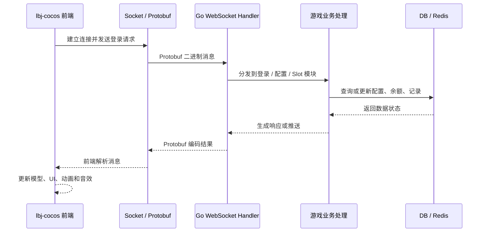

# AI Workflow

> 本文档说明该项目如何使用 AI / Codex 从游戏说明文档开始，逐步拆解前后端模块，再推进 Go 后端 `slotgame-go` 与 Cocos 前端 `lbj-cocos` 的开发和联调。本文只展示脱敏后的工作方式，不公开源码、真实配置、协议细节、服务器地址或运营数据。

## 目标

这个项目的重点是“AI 辅助游戏全栈开发”，不是单纯展示 Go 后端或 Cocos 前端。整体流程是：

1. 用 AI 生成游戏说明文档。
2. 基于说明文档拆解前端、后端、协议和数据模块。
3. 按模块开发 Go 后端和 Cocos 前端。
4. 通过 WebSocket + Protobuf 做实时协议联调。
5. 将联调过程、排查方式和模块职责沉淀成公开展示文档。

## 项目输入

### Go 后端：slotgame-go

后端项目提供游戏运行所需的服务能力，脱敏后的模块包括：

- `routes/`：HTTP API 路由。
- `websocket/`：实时连接、登录、配置、Slot 玩法协议处理。
- `proto/` / `internal/pb/`：Protobuf 协议定义与生成产物。
- `repository/`：数据访问层。
- `models/`：数据模型。
- `sgdb/`：数据库与 Redis 连接。
- `mqtt/`：MQTT 远程控制、重连、消息路由和状态回传。
- `logger/`：日志封装。
- `main.go`：服务启动入口，负责配置、日志、数据库、Redis、MQTT、HTTP 和 WebSocket 初始化。

### Cocos 前端：lbj-cocos

前端项目负责游戏表现和用户操作，脱敏后的模块包括：

- `assets/scene/`：启动场景。
- `assets/script/`：启动脚本和基础插件。
- `assets/common/script/GameEntry.ts`：游戏入口和全局初始化。
- `assets/common/script/common/net/`：Socket 连接和协议传输。
- `assets/common/script/proto/`：前端协议编解码。
- `assets/common/script/modulecontroller/`：登录、配置、Slot 等模块控制器。
- `assets/common/script/model/`：登录、配置、Slot、卷轴和符号等状态模型。
- `assets/common/script/view/home/`：主界面和游戏界面。
- `assets/common/script/view/slot/`：卷轴、符号、按钮、中奖表现等 Slot 视图。
- `assets/resources/prefab/`：动态加载的 UI 和游戏预制体。
- `settings/`：Cocos Creator 构建配置。

## AI 生成游戏说明文档

第一步不是直接写代码，而是先让 AI 帮助把“游戏要做什么”整理清楚。文档重点包括：

- 游戏核心玩法：Slot 主玩法、按钮操作、下注、自动模式、中奖表现和结算。
- 前端表现：启动、加载、主界面、卷轴滚动、停轮、中奖动画、弹窗和音效。
- 后端能力：登录、配置、房间状态、玩法请求、结果推送、余额和记录持久化。
- 协议边界：哪些状态由前端展示，哪些结果由后端计算，哪些数据需要实时推送。
- 运行边界：本地开发、联调环境、可选 MQTT、数据库和缓存依赖。

这样做的价值是先形成一份统一语言的游戏说明，避免前端只按界面理解、后端只按接口理解，导致联调时反复返工。

## AI 拆解前后端模块

在游戏说明文档基础上，继续用 AI 拆成可开发模块。

### 后端拆解

- HTTP 路由：健康检查、配置、调试或管理类接口。
- WebSocket Handler：连接管理、登录、配置、Slot 命令分发和错误处理。
- Protobuf：请求、响应、推送消息的结构约定。
- Service / Runtime：玩法状态、转动结果、结算、JP 或特殊表现的业务处理。
- Repository：余额、记录、配置、奖池等数据访问。
- DB / Redis：持久化状态、缓存、会话或流水号。
- MQTT：远程控制、状态回传和可选云控能力。

### 前端拆解

- 启动链路：启动场景、启动脚本、bundle 加载、入口初始化。
- 网络链路：Socket 连接、Protobuf 编解码、断线与加载状态。
- 模块控制器：登录、配置、Slot 玩法消息处理。
- 状态模型：余额、下注、卷轴、中奖、自动模式、配置状态。
- 视图模块：主界面、卷轴、符号、按钮、中奖表现、弹窗。
- 资源管理：Prefab、音频、图集、动画和动态加载资源。

## 开发 Go 后端

后端开发按“协议先行、模块落地、数据兜底”的方式推进。

1. 先确定前端需要发送和接收的消息类型。
2. 再整理 WebSocket Handler 的分发边界。
3. 然后落到玩法处理、数据模型、Repository 和缓存。
4. 最后补充日志、错误码、测试入口和可选 MQTT 控制。

AI / Codex 在后端开发中主要用于：

- 阅读目录结构并输出模块职责。
- 对照 Protobuf 和 Handler 梳理消息流。
- 生成联调清单和错误排查步骤。
- 辅助定位连接、解码、状态更新、余额同步和推送时序问题。

## 开发 Cocos 前端

前端开发按“启动可跑、界面可见、协议可通、表现完整”的方式推进。

1. 先确认 Cocos 启动场景和入口初始化。
2. 再接入 Socket 连接和 Protobuf 编解码。
3. 然后实现主界面、卷轴、按钮、下注、自动模式等表现。
4. 最后处理后端推送、中奖动画、结算展示、弹窗和异常状态。

AI / Codex 在前端开发中主要用于：

- 梳理 `GameLaunch`、`GameEntry`、资源加载和 UI 打开顺序。
- 根据目录和 Prefab 命名整理界面模块职责。
- 对照后端消息流梳理前端 Model 和 ModuleController。
- 辅助排查 Socket 状态、资源加载、动画时序和 UI 状态不同步问题。

## 联调协议

前后端联调以 WebSocket + Protobuf 为核心。



联调时重点检查：

- 连接是否建立成功。
- 登录和配置是否先于玩法消息完成。
- 前端发送的命令是否进入正确 Handler。
- Protobuf 字段是否与前端解析一致。
- 后端推送是否能驱动前端 UI 和动画。
- 余额、下注、中奖、自动模式等状态是否同步。
- 异常、断线、重连和错误提示是否可解释。

## AI 辅助排查方式

当联调出现问题时，不直接盲改代码，而是先让 AI 帮助把问题归类：

- 连接问题：端口、路径、握手、断线、重连。
- 协议问题：命令号、消息类型、字段缺失、编码或解码失败。
- 状态问题：前端 Model 未更新、后端数据未写入、推送顺序不对。
- 表现问题：资源未加载、动画时序错误、按钮状态和自动模式冲突。
- 数据问题：余额、记录、配置、缓存和数据库状态不一致。

AI 的作用是帮助快速建立排查路径，最终仍以实际日志、协议消息、运行状态和代码行为为准。

## 公开展示边界

可以公开：

- AI 开发流程。
- 脱敏模块说明。
- 前后端联调流程。
- 架构图和流程图。
- 已确认无敏感信息的截图、GIF 或视频。

不会公开：

- Go / Cocos 源码。
- 真实服务器地址、数据库配置、MQTT 凭证、Token、密钥。
- 生产部署脚本和内部协议细节。
- 真实运营数据、账号、流水、日志。
- 商业美术资源、未打码二维码或用户信息。

## 后续素材规划

后续截图放入 `assets/` 后，建议按以下方式命名：

```text
assets/01-game-doc.png          # AI 生成游戏说明文档或文档片段
assets/02-cocos-gameplay.png    # Cocos 前端游戏画面
assets/03-backend-structure.png # Go 后端脱敏结构或服务图
assets/04-protocol-flow.png     # 前后端协议联调流程
```

截图上传前需要确认没有真实地址、账号、Token、二维码、余额、用户信息、日志或私有源码。
